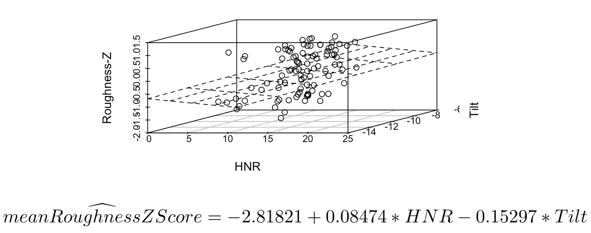
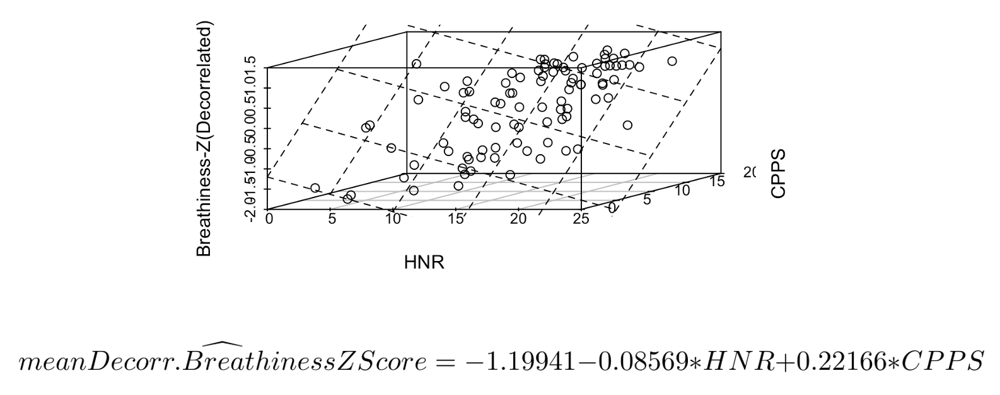
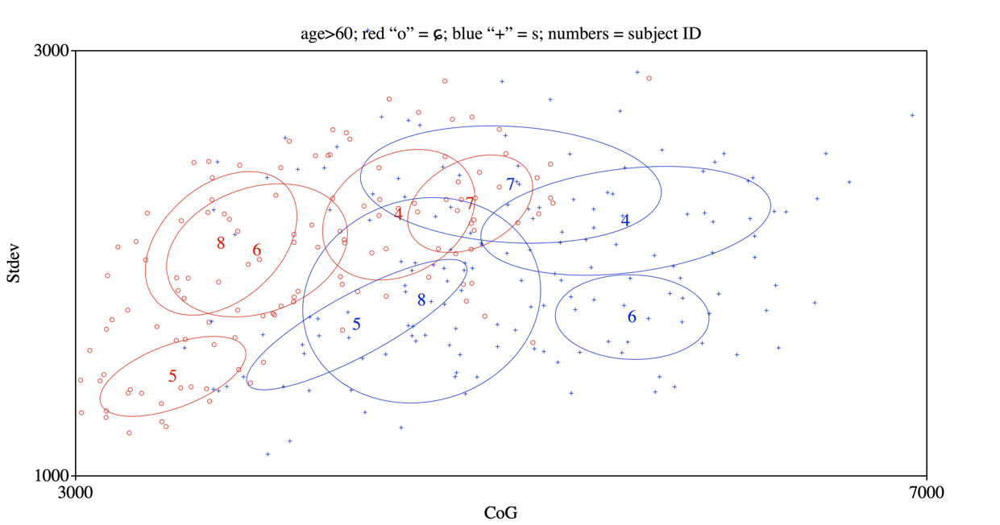
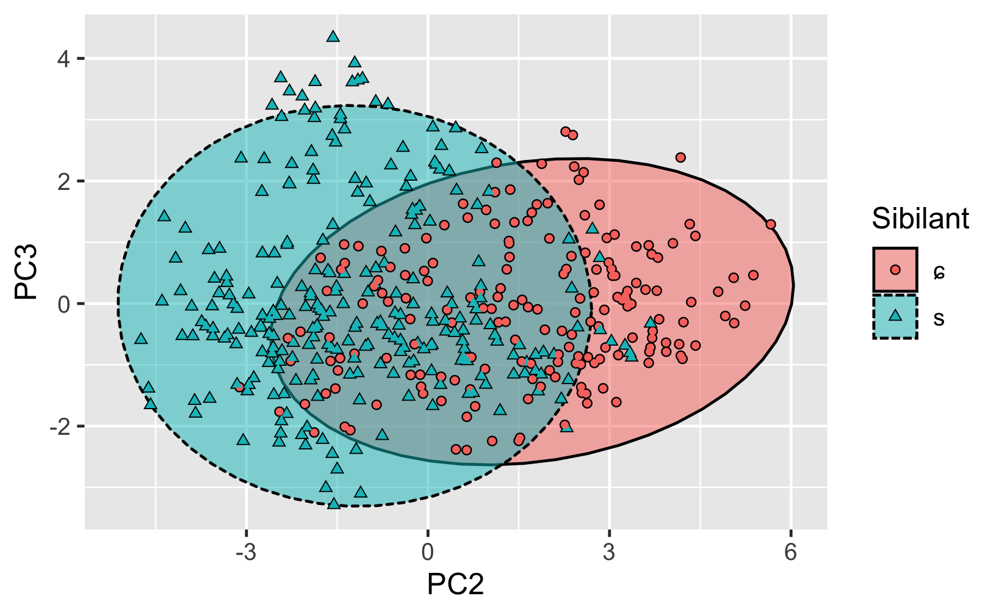
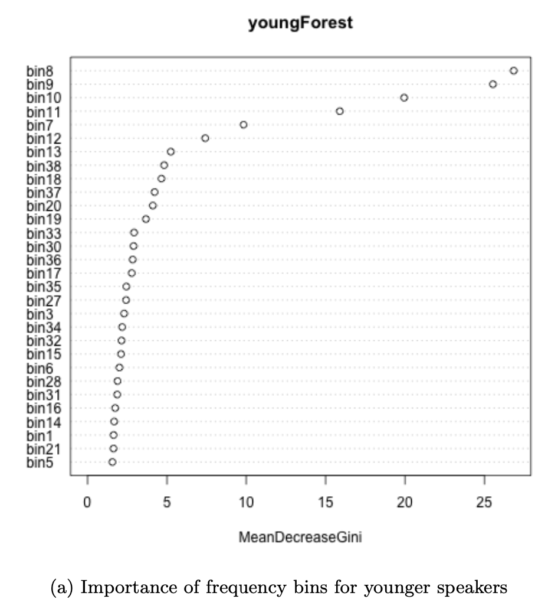
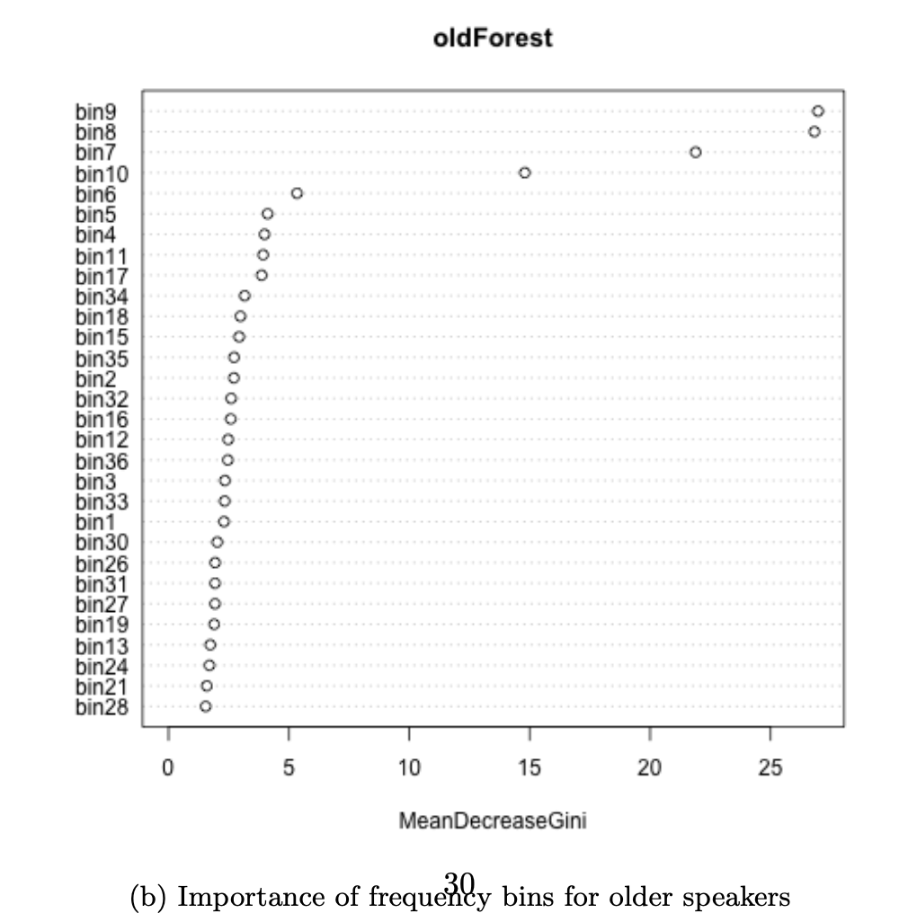

````{=html}
<head>
		<title>Xinyu Zhang's Page</title>
		<meta charset="UTF-8">
		<!-- Global site tag (gtag.js) - Google Analytics -->
		<script async src="https://www.googletagmanager.com/gtag/js?id=UA-143097840-1"></script>
		<script>
 		window.dataLayer = window.dataLayer || [];
  		function gtag(){dataLayer.push(arguments);}
  		gtag('js', new Date());
  		gtag('config', 'UA-143097840-1');
		</script>
</head>
```` 

```{r, echo=FALSE, out.width="100%"}
knitr::include_graphics("spectrogram.png")
```


## Bio

Xinyu Zhang ([ɕin˥˥ɥy˨˩˦ ʈ͡ʂɑŋ˥˥]) is a linguist in training. She currently
studies at [ACLC](https://aclc.uva.nl/about/about-aclc-update.html) of [University of Amsterdam](https://https://www.uva.nl/en), under the supervision of [Dr. Rob van Son](https://www.fon.hum.uva.nl/rob/) and [Dr. Paul Boersma](https://www.fon.hum.uva.nl/paul/). Her main areas of interest are phonetics and phonology, acoustic and articulatory phonetics, and production-perception interaction.

Her most recent research projects include a study on the cross-generation auditory dispersion of the Dutch sibilants /s/ and /ɕ/, and a study of the psychoacoustics of perceived voice qualities after the treatment of laryngeal carcinoma.

Please like and subscribe :)

## Education

**University of Amsterdam - ACLC** | Amsterdam, The Netherlands

M.Phil in Linguistics | September 2019 - Now

**University of Amsterdam** | Amsterdam, The Netherlands

MA in General Linguisitics | September 2018 - August 2020

## Party Tricks

**Praat sings Happy Birthday** | [Praat Script](https://github.com/xinyu-z/xinyu-z.github.io/blob/master/PraatSingsHappyBDay_XinyuZhang.praat) | © Xinyu Zhang, 2019


**Let R automate participant notification email for ya** | [R script + Rmd](https://github.com/xinyu-z/xinyu-z.github.io/blob/master/automail)|© Mine Çetinkaya-Rundel, 2015; modified by Xinyu Zhang, 2021

## Results from the voice quality study:

**Progress as of March 3, 2021** 

- View [slides](https://github.com/xinyu-z/xinyu-z.github.io/blob/master/MPhilThesisPresentation.pdf)

- Some highlights:

```{r, echo=FALSE, out.width="100%", fig.cap = "Roughness as predicted by acoustic measurements"}

```


```{r, echo=FALSE, out.width="100%", fig.cap = "De-correlated breathiness as predicted by acoustic measurements"}

```

## Results from the sibilant study

(All participants who indicated interest in the findings on the consent form have been emailed the full results. Thank you all for donating your voices <3)

If you want to read the whole paper: [PDF](https://scripties.uba.uva.nl/search?id=c3239102). 

Otherwise, some TL;DR:

**Acoustic distance between [ɕ] and [s] in each participant, separated by age group:**

```{r, echo=FALSE, out.width="100%", fig.cap = "Speakers aged between 18-30, Center of Gravity on X-axis, standard deviation of the peak on Y-axis"}
knitr::include_graphics("CoG-StdevY.png")
```

```{r, echo=FALSE, out.width="100%", fig.cap = "Speakers aged above 60, Center of Gravity on X-axis, standard deviation of the peak on Y-axis"}

```
The red and blue circles in the above plot for older speakers have more overlap than in the first plot for young speakers.

**Alternatively, if we run a PCA on energies by frequency bins:**

“Elements” in the following plots refer to frequency bins in the long-term-average-spectra (bin width = 250 Hz, LTAS range = 550 - 10000 Hz).
```{r, echo=FALSE, out.width="100%", fig.cap = "Eigenvector 1 looks like it's just amplitude difference"}
knitr::include_graphics("Eigenvector1.png")
```

If we then plot eigenvector 2 against 3 by age group:
```{r, echo=FALSE, out.width="100%", fig.cap = "age > 60"}

```

```{r, echo=FALSE, out.width="100%", fig.cap = "18< age < 30"}
knitr::include_graphics("PC2PC3Y.png")
```
We can also try some random forest!
```{r, echo=FALSE, out.width="100%", fig.cap = "ranking of bins in the younger speakers"}

```

```{r, echo=FALSE, out.width="100%", fig.cap = "ranking of bins in the older speakers"}

```


## Things you didn't need to know:

If you want to get to know me a tiny bit better, here are my cardinal vowels plotted.

(I mean, what better way to get to know someone, right?)

```{r, echo=FALSE, out.width="80%"}
knitr::include_graphics("cardinalVowels.png")
```